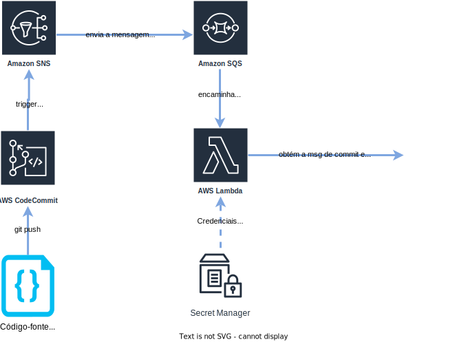

# codecommit-jira-integration

Infraestrutura necessária na AWS para criar uma integração entre o jira e o codecommit. A integração em si consiste em criar um trigger no codecommit
para toda vez em que um commit é realizado no repositório, é disparado um lambda que obtém a mensagem de commit, e adiciona a mensagem de commit como 
um comentário na atividade JIRA correspondente. A infraestrutura criada corresponde a imagem abaixo:



Toda a infraestrutura para a integração funcionar está descrita em scripts terraform. Após a execução do script, deve-se obter o ARN do tópico SNS criado e criar um trigger no repositório 
desejado no CodeCommit, associando-o ao tópico SNS. O tipo do trigger deve ser "Enviar para a ramificação existente". Assim, sempre que uma alteração no repositório for enviada para origin, o trigger é disparado e o lambda inicia sua execução. O tópico SNS pode ser reaproveitado em outras triggers de repositório.

O lambda foi desenvolvido para reconhecer apenas mensagens de commit utilizando o padrão [Conventional Commits](https://www.conventionalcommits.org/en/v1.0.0-beta.2/). Qualquer commit fora deste padrão gerará uma exceção na execução do lambda. No escopo da mensagem, deve ser adicionado o ID da issue jira no qual o comentário será adicionado. Caso o escopo não seja passado, a mensagem é reconhecida mas o comentário não é escrito. Exemplo:

```
# Mensagem de commit aceita, e cujo conteúdo será adicionado a issue JIRA correspondente como comentário:
"fix(ID-1234): resolvendo query de retorno dos dados"

# Mensagem de commit aceita, e cujo conteúdo não será adicionado a nenhuma issue JIRA:
"feat: adicionando login de terceiros na tela de usuário"

# Mensagem de commit não aceita:
"mensagem qualquer de commit"
```

## Pré-requisitos e primeiros passos

* Python versão 3.5+
* Gerenciador de pacotes pipenv
* Client AWS devidamente instalado e configurado (`$ aws configure`)
* Terraform instalado com uma versão mínima presente no arquivo terraform/versions.tf

Após o clone e acessar a pasta, executar os comandos:

```
$ pipenv install 
$ cd terraform
$ terraform init # inicializando o terraform. Para mais detalhes, ver a seção Workspaces)
```

Ao criar um novo tfstate, talvez seja necessário importar recursos pré-existentes. Sendo assim, caso seja necessário, importe os
seguintes recursos pré-existentes:

* `terraform import -var-file='./workspace/<seu_ambiente>.tfvars' module.s3.aws_s3_bucket.infra_bucket <nome_do_bucket_existente>`


## Workspaces

Workspaces são ambientes virtuais onde valores específicos de variáveis e estados são carregados para uma execução mais segura. Cada workspace também terá um arquivo próprio de variáveis, (ex: hml.tfvars) onde vai conter os valores específicos do ambiente para as 
variáveis de entrada.

```bash

# criando um novo workspace
$ terraform workspace new <nome_do_workspace>

# salvando tfstate para uso futuro (normalmente usado após um apply ou plan)
$ terraform state pull > <nome_do_workspace>.tfstate

# selecionando e ativando um workspace já existente
$ terraform workspace select <nome_do_workspace>

# restaurando tfstate (normalmente utilizado após um switch workspace)
$ terraform state push <nome_do_workspace>.tfstate

```

## Comandos básicos

**OBS: É importante que estes comandos sejam executados após a seleção do workspace correto!!**

```bash

# Executar um planejamento das alterações que serão realizadas
$ terraform plan -var-file='caminho/para/arquivo.tfvars'

# Aplicando as alterações
$ terraform apply -var-file='caminho/para/arquivo.tfvars'

# Removendo a infraestrutura (OBS: não utilizar em ambiente produtivo)
$ terraform destroy -var-file='caminho/para/arquivo.tfvars'

# Removendo recursos da "alçada" do terraform
$ terraform state rm aws_kms_alias.s3kmskey

```

## Troubleshooting

Caso, durante a execução do script jupyter, a seguinte mensagem seja exibida: `Error loading plugin: libhspell.so.0: cannot open shared object file: No such file or directory`, basta instalar o pacote `hspell`, no linux.